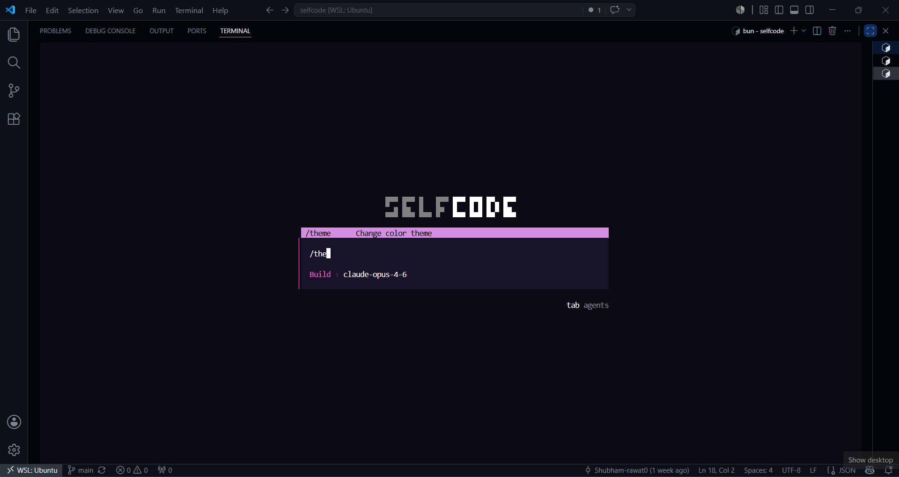
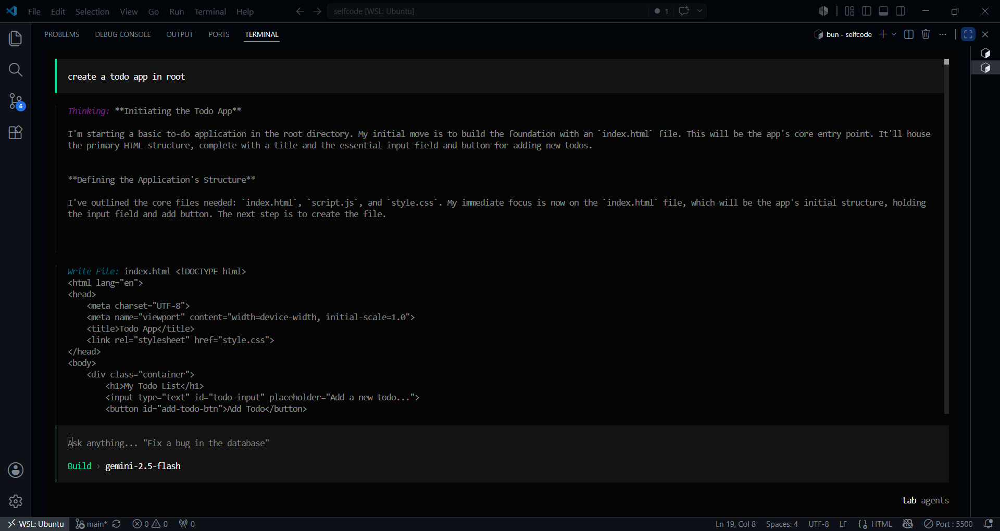
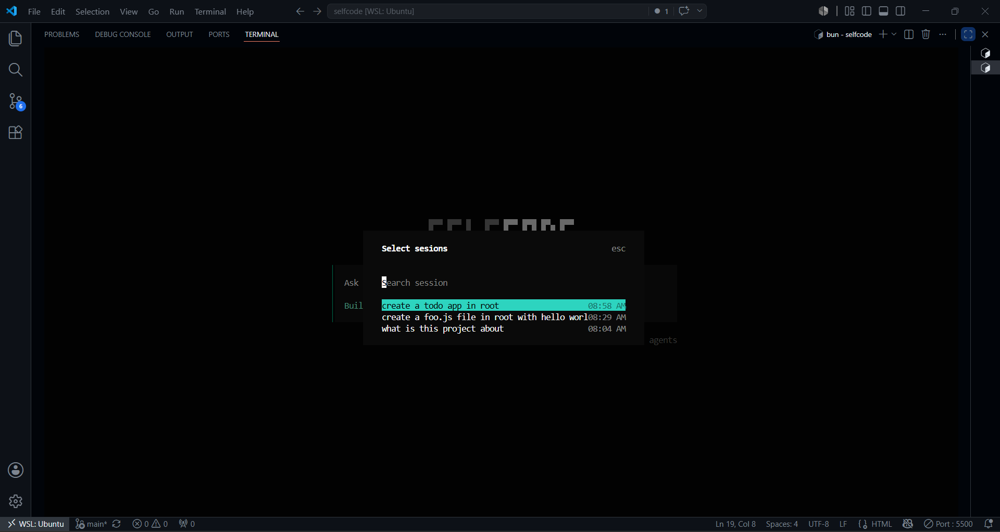

# SelfCode

Open-source terminal AI agent for software engineering.

Plan tasks, execute tools locally, modify files, run commands, and build real projects directly from your terminal.

---

## Screenshots

### Interactive Terminal Experience



### Building & Tool call




### Session Persistence



---

## Project Structure

The project consists of two main parts:

### CLI

* Built with OpenTUI
* React-based terminal interface
* TypeScript
* Interactive streaming chat experience
* Client-side tool execution
* Session persistence
* OAuth authentication flow
* Located in the `/packages/cli` directory

### SERVER

* Node.js with Express
* TypeScript
* AI SDK integration
* OpenRouter and OpenAI support
* Clerk authentication
* PostgreSQL database with Prisma ORM
* Conversation and session management
* Located in the `/packages/server` directory

---

## Getting Started

### Prerequisites

* Node.js (v20+)
* PostgreSQL
* bun

---

## Backend Setup

Navigate to the backend directory:

```bash
cd packages/server
```

Install dependencies:

```bash
bun install
```

Set up environment variables:

Create a `.env` file in the backend directory.

```env
API_URL=

DATABASE_URL=
GOOGLE_GENERATIVE_AI_API_KEY=A

CLERK_OAUTH_CLIENT_SECRET=
CLERK_OAUTH_CLIENT_ID=
CLERK_FRONTEND_API=
CLERK_PUBLISHABLE_KEY=
CLERK_SECRET_KEY=

JWT_SECRET=

POLAR_ACCESS_TOKEN=
POLAR_PRODUCT_ID=
POLAR_SERVER=
POLAR_CREDITS_METER_ID=

```bash
bunx prisma migrate dev
```

Generate Prisma client:

```bash
bunx prisma generate
```

Start the backend server:

```bash
# Development mode
bun run dev:server

---

## CLI Setup

Navigate to the CLI directory:

```bash
cd packages/cli
```

Install dependencies:

```bash
bun install
```

Run the CLI:

```bash
bun run dev
```


Start chatting:

```bash
selfcode chat
```

---

## Backend Architecture

The backend is built with Express and acts as the orchestration layer between language models, authentication, persistence, and tool execution.

### Key Components

**AI Gateway**

* Routes requests to AI provider
* Handles streaming responses
* Supports structured outputs and tool calls

**Authentication**

* Clerk integration
* OAuth 2.0 Authorization Code Flow
* PKCE verification

**Session Management**

* Persistent conversations
* Conversation history
* Project-scoped sessions

**Database**

* PostgreSQL
* Prisma ORM
* User and session storage

**Streaming Layer**

* Real-time response streaming
* Tool call synchronization
* Incremental UI updates

---

## Authentication Flow

SelfCode uses OAuth 2.0 Authorization Code Flow with PKCE.

### Security Features

* No client secrets stored locally
* Secure browser-based login
* PKCE challenge verification
* Token-based authentication
* Session validation and refresh

---

## Client-Side Tool Execution

Unlike traditional AI agents, SelfCode executes tools directly on the user's machine.

### Supported Tool Categories

* Read files
* Write files
* Edit files
* Search files
* List directories
* Execute terminal commands
* Manage project context

### Benefits

* Direct filesystem access
* Lower latency
* Improved privacy
* Reduced server-side risk
* Works naturally with existing repositories

---

## Session Persistence

SelfCode automatically persists conversations and project context.

### Features

* Resume previous conversations
* Project-aware memory
* Session restoration
* Long-running workflows
* Persistent chat history

---

## Database Schema

The database uses Prisma ORM with the following main models:

### User

Stores authenticated user information.

### Session

Represents a conversation session.

### Message

Stores user and assistant messages.

### Usage

Tracks model usage and billing information.

---

## CLI Architecture

The CLI is built using OpenTUI and provides an interactive terminal-native experience.

### Key Components

**Chat Interface**

* Streaming responses
* Rich terminal rendering
* Keyboard navigation

**Tool Runtime**

* Executes tools locally
* Returns results to the AI model
* Handles command execution

**Session Manager**

* Restores conversations
* Persists local state
* Synchronizes with backend

**Authentication Manager**

* Handles OAuth login
* Stores credentials securely
* Manages token refresh

---

## Technologies Used

### CLI

* OpenTUI
* React
* TypeScript
* Zod

### Backend

* Express
* TypeScript
* Prisma

### Authentication

* Clerk
* OAuth 2.0
* PKCE

### AI Infrastructure

* AI SDK
* OpenRouter
* OpenAI

### Database

* PostgreSQL
* Prisma ORM

---


## Recent Improvements

### Backend Enhancements

* Added persistent session management
* Implemented streaming AI responses
* Improved tool call orchestration
* Added usage tracking
* Enhanced database performance
* Improved error handling and recovery

### CLI Enhancements

* Added client-side tool execution
* Improved terminal rendering
* Added session restoration
* Enhanced authentication flow
* Improved streaming experience
* Added project-aware context management

### Security Enhancements

* Implemented OAuth PKCE flow
* Added secure token storage
* Improved session validation
* Enhanced authentication reliability
